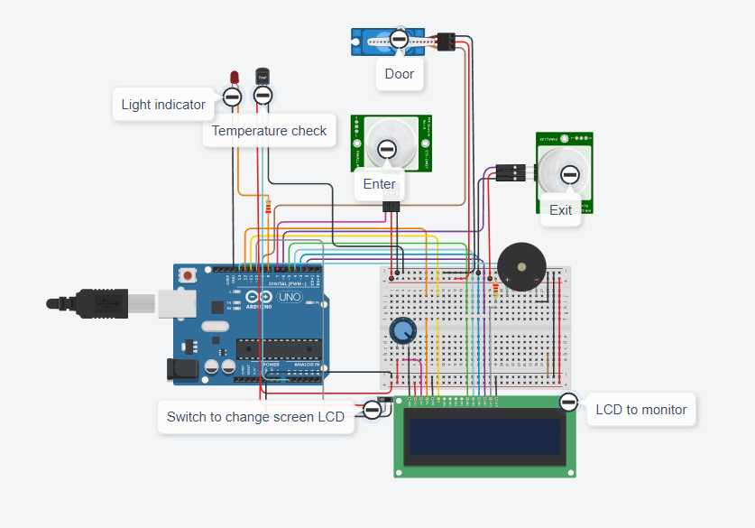

<!-- PROJECT Tittle and description -->

 <h1 align="center">Visitor-Counter-System
</h1>
  <h3 align="center"> During Covid-19 we need to monitor the person/people visiting someplace like shopping mall, conference room or office. This project can be used to count and display the number of visitors entering inside the room. This is a unidirectional counter which means it works in a single way. That means a counter will be incremented if a person enters the room. LCD displays this value which is placed outside the room. </h3>

## Built With

[![Arduino][Arduino.js]][Arduino-url] [![Thinkercad][Thinkercad.js]][Thinkercad-url]

## Component
- Arduino UNO
- LCD 16*2 
-PIR Sensor x2
- Buzzer
- Breadboard
- Jumper wire 
- Resistor
- Potentiometer
- Servo
- Temperature Sensor

## Circuit Diagram

[Link To Tinkercad][https://www.tinkercad.com/things/hDiutcn8QrX]

## Demonstration 
Demo 1 
<!-- MARKDOWN LINKS & IMAGES -->
[Thinkercad.js]: https://img.shields.io/badge/Thinkercad-4ddbff?style=for-the-badge&logo=thingspeak&logoColor=white
[Thinkercad-url]: https://www.tinkercad.com/
[Arduino.js]: https://img.shields.io/badge/Arduino-00b3b3?style=for-the-badge&logo=arduino&logoColor=white
[Arduino-url]: https://firebase.google.com/
